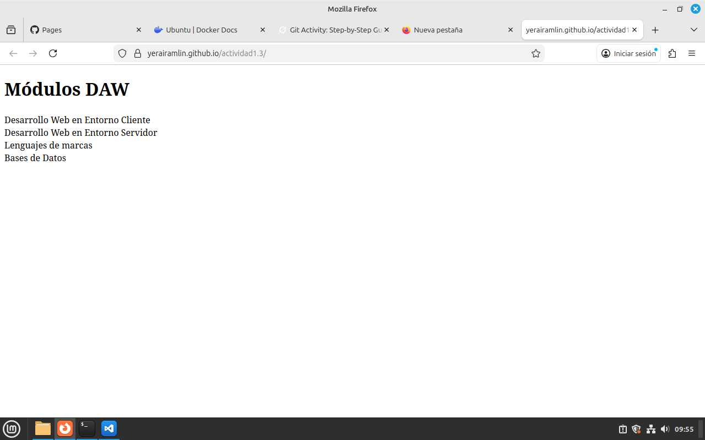

# actividad1.3

**Repositorio creado para la asignatura Despliegue de Aplicaciones Web**

## Objetivo
_Practicar Git, GitHub, ramas, conflictos y GitHub Pages_

### Tecnologías usadas
- Git
- GitHub
- VSCode
- Docker
- Markdown
- HTML5 + CSS3 + JavaScript

## Enlace al sitio web publicado
[Visitar dawAct1.3 en GitHub Pages](https://yerairamlin.github.io/actividad1.3/)

## Captura del proyecto


## Comando Git favorito
```bash
git log --oneline --graph --all --decorate